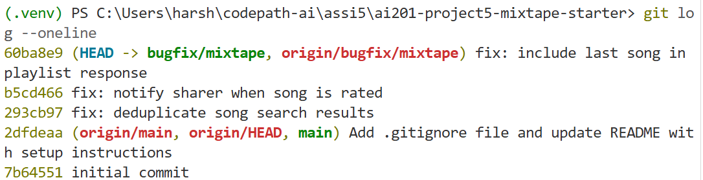

# AI Usage

I used AI to help me understand the structure of the unfamiliar codebase, plan a debugging workflow, and trace how the route files connect to the service files. I used AI support for codebase orientation and debugging guidance, but I verified behavior by running the Flask app locally, calling the API endpoints, reading the relevant files myself, and testing each fix before committing.

# Codebase Map

## Main files and responsibilities

- `app.py`: Creates the Flask application, initializes the database, and registers the route blueprints.
- `models.py`: Defines the SQLAlchemy database models used by the app, including users, songs, playlists, playlist-song relationships, notifications, and listening/streak-related data.
- `seed_data.py`: Seeds the local database with sample users, songs, playlists, listens, ratings, and notifications so the reported bugs can be reproduced.
- `routes/feed.py`: Defines feed-related API endpoints, including the "Friends Listening Now" endpoint.
- `routes/playlists.py`: Defines playlist-related API endpoints, including adding songs to playlists and fetching playlist songs.
- `routes/songs.py`: Defines song-related API endpoints, including song search and song rating.
- `routes/users.py`: Defines user-related API endpoints, including streak and notification routes.
- `services/feed_service.py`: Contains feed business logic, including deciding which friends appear in the listening-now feed.
- `services/notification_service.py`: Contains notification creation and retrieval logic.
- `services/playlist_service.py`: Contains playlist business logic, including adding and returning playlist songs.
- `services/search_service.py`: Contains song search logic.
- `services/streak_service.py`: Contains listening streak calculation/update logic.

## Data flow example: searching for a song

1. The client sends a request to `GET /songs/search?q=<query>`.
2. `routes/songs.py` receives the request and reads the search query from the URL.
3. The route calls the search-related service function in `services/search_service.py`.
4. The service searches matching songs from the database.
5. The route returns a response containing the result count and list of matching songs.

## Pattern noticed

The app is organized with a clear route/service split. Route files handle HTTP request parsing and response formatting, while service files contain the actual application logic. The reported bugs are likely in service-layer logic rather than route definitions.

## Issue #3 — The same song keeps showing up twice in search

### How I reproduced it

I tested the search endpoint by calling `GET /songs/search?q=Anthem` and inspected the response returned by the app. I also tested broader search queries to check whether the same song could appear more than once when the query matched songs that had multiple associated tags.

### How I found the root cause

I started from `routes/songs.py` and found that the `/songs/search` route reads the `q` parameter and calls `search_songs(query)` from `services/search_service.py`. In `search_service.py`, I noticed that the song query used an outer join with the `song_tags` table even though the search filter only checked the song title and artist.

### The root cause

The search query joined songs to the `song_tags` table. Since a single song can have multiple tags, the join could create multiple database rows for the same song. The search logic then converted the query results into dictionaries without needing that join, which could cause duplicate song entries in the API response.

### My fix and side-effect check

I removed the unnecessary outer join from the search query because the endpoint only searches by song title and artist. This keeps each matching song represented once while still allowing `song.to_dict()` to include the song’s tag data. After the change, I retested the search endpoint and confirmed that matching songs still appear and duplicate entries are not returned.

## Issue #4 — I got notified when a friend added my song to a playlist but not when they rated it

### How I reproduced it

I tested the rating endpoint by sending a `POST` request to `/songs/<song_id>/rate` using a user who was not the original sharer of the song. The rating was saved successfully, but when I checked the original sharer’s notifications using `GET /users/<user_id>/notifications`, no new notification appeared for the rating.

### How I found the root cause

I started from `routes/songs.py` and found that the rating route calls `rate_song(user_id, song_id, int(score))` from `services/notification_service.py`. I compared `rate_song()` with the existing `add_to_playlist()` function in the same file. `add_to_playlist()` created a notification for the song’s original sharer, but `rate_song()` only saved the rating and returned it.

### The root cause

The rating workflow had no notification creation step. The app saved or updated the `Rating` record, but it never called `create_notification()` after a user rated someone else’s shared song. Because of that missing service-layer behavior, the rating existed in the database but no notification was created for the original sharer.

### My fix and side-effect check

I added notification creation to `rate_song()` after the rating is saved. The function now checks whether the rater is different from the original sharer and creates a `song_rated` notification for the sharer. I retested the rating endpoint and then checked the sharer’s notifications to confirm that a rating notification is now created. I also kept the self-rating check so users do not receive notifications for rating their own shared songs.

## Issue #5 — The last song in a playlist never shows up

### How I reproduced it

I tested the playlist songs endpoint by calling `GET /playlists/<playlist_id>/songs` for a seeded playlist and comparing the returned `count` and song list against the expected playlist contents. The endpoint returned one fewer song than expected. After tracing the playlist order, I confirmed that the missing song was the last song in the ordered list. This matched the reported behavior where the most recently added song was always hidden.

### How I found the root cause

I started from `routes/playlists.py`, where the `/playlists/<playlist_id>/songs` route calls `get_playlist_songs(playlist_id)` from `services/playlist_service.py`. In `get_playlist_songs()`, I found that the database query correctly fetched songs ordered by playlist position, but the return statement sliced the result list with `songs[:-1]`.

### The root cause

The function was intentionally or accidentally dropping the last item from the list before returning it. In Python, `songs[:-1]` returns every element except the final one. Since playlist songs are ordered by position, the final item is the most recently added song, so the endpoint always hid the newest playlist song.

### My fix and side-effect check

I changed the return statement to iterate over `songs` instead of `songs[:-1]`, so every song returned by the database query is included in the API response. I checked that the ordering logic was unchanged and that the endpoint still returns songs in ascending playlist position.

# Screenshot of git log --oneline
